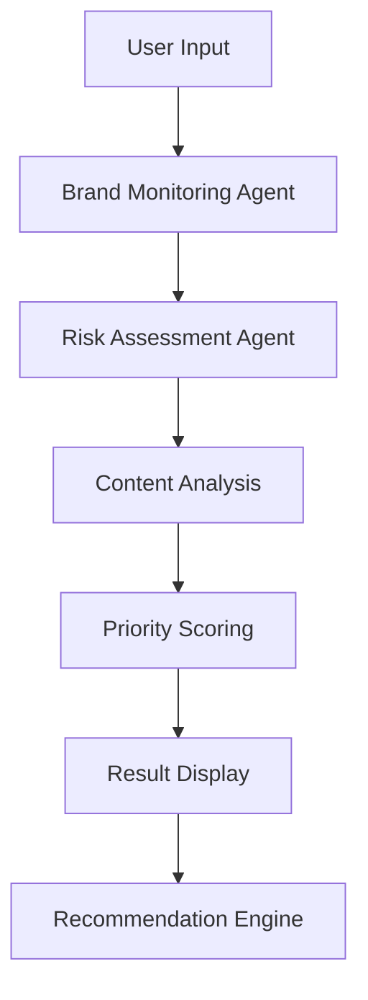
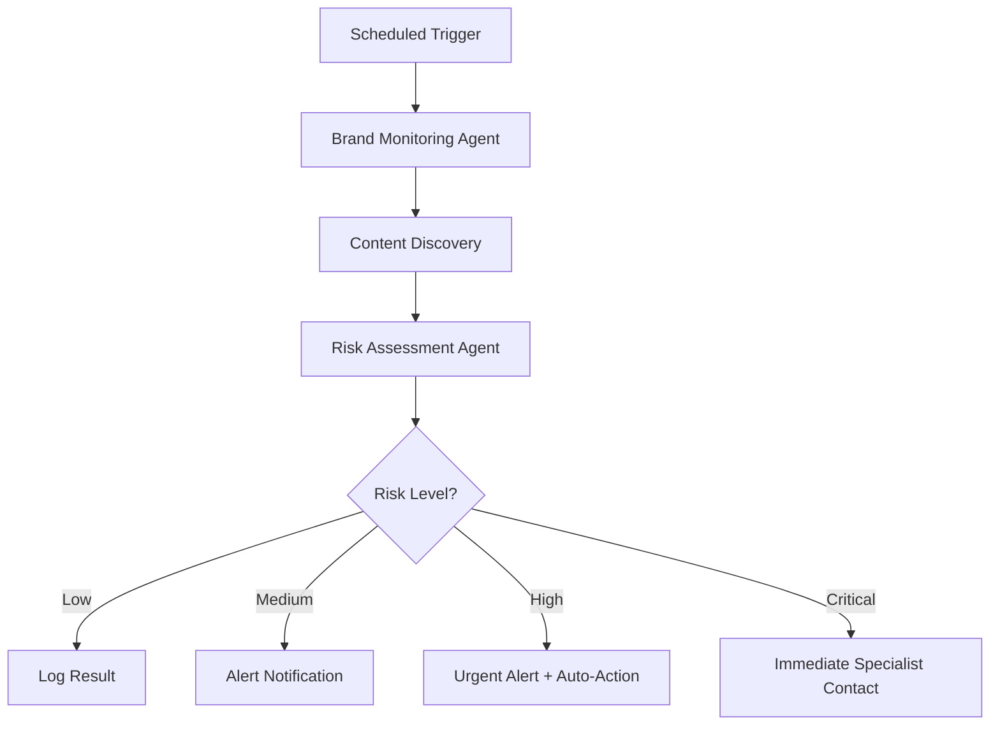
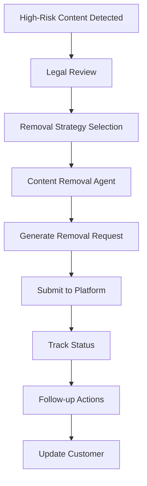

# RepShield.io AI Agents & Automation Systems

## 🤖 Overview

RepShield.io employs multiple AI agents and automation systems to provide comprehensive reputation management services. This document outlines the various agents, their responsibilities, and how they work together.

## 🧠 Core AI Agents

### 1. Brand Monitoring Agent
**Purpose**: Continuous monitoring of online mentions across platforms

**Capabilities**:
- Real-time Reddit monitoring via API
- Social media mention detection
- News article scanning
- Review site monitoring
- Multi-language content analysis

**Technology Stack**:
- Reddit API integration
- ScrapingBee for web scraping
- OpenAI GPT-4 for content analysis
- Custom sentiment analysis algorithms

**Operation Schedule**:
- High-priority brands: Every 5 minutes
- Standard monitoring: Every 30 minutes
- Comprehensive sweeps: Every 24 hours

```typescript
// Brand Monitoring Agent Configuration
interface BrandMonitoringConfig {
  brandName: string;
  priority: 'low' | 'standard' | 'high' | 'critical';
  platforms: Platform[];
  alertThreshold: SentimentScore;
  scanFrequency: number; // minutes
}
```

### 2. Risk Assessment Agent
**Purpose**: Analyze content for reputation risk and priority scoring

**Capabilities**:
- Sentiment analysis (positive, negative, neutral)
- Threat level assessment (low, medium, high, critical)
- Viral potential prediction
- Legal risk evaluation
- User influence scoring

**Analysis Factors**:
- Content sentiment and tone
- Post engagement metrics
- Author credibility and follower count
- Platform reach and demographics
- Historical escalation patterns

```typescript
// Risk Assessment Output
interface RiskAssessment {
  sentimentScore: number; // -1 to 1
  threatLevel: 'low' | 'medium' | 'high' | 'critical';
  viralPotential: number; // 0 to 100
  legalRisk: boolean;
  recommendedAction: ActionType;
  urgencyScore: number; // 1 to 10
}
```

### 3. Content Removal Agent
**Purpose**: Automated content removal request generation and tracking

**Capabilities**:
- DMCA takedown notice generation
- Platform-specific removal request formatting
- Legal compliance verification
- Follow-up automation
- Success rate tracking

**Supported Platforms**:
- Reddit (mod mail, admin contact)
- Google (search result removal)
- Social media platforms
- Review sites (Yelp, Google Reviews, etc.)

### 4. Customer Communication Agent
**Purpose**: Automated customer interactions and support

**Capabilities**:
- Instant chat responses to common queries
- Scan result explanations
- Service recommendation engine
- Escalation to human specialists
- Follow-up communication automation

**Communication Channels**:
- Website live chat
- Email automation
- SMS notifications
- Telegram alerts (for admins)

### 5. Data Analysis Agent
**Purpose**: Generate insights and reports from monitoring data

**Capabilities**:
- Trend analysis and pattern recognition
- Competitor reputation benchmarking
- ROI calculation for removal efforts
- Predictive analytics for future risks
- Custom report generation

## 🔄 Agent Workflows

### Quick Scan Workflow


### Automated Monitoring Workflow


### Content Removal Workflow


## 🎯 Agent Performance Metrics

### Brand Monitoring Agent
- **Detection Speed**: < 15 minutes for new mentions
- **Accuracy Rate**: 95%+ relevant mention detection
- **Platform Coverage**: 15+ major platforms
- **False Positive Rate**: < 5%

### Risk Assessment Agent
- **Analysis Speed**: < 2 seconds per piece of content
- **Prediction Accuracy**: 87% for viral content prediction
- **Threat Classification**: 92% accuracy vs human review
- **Legal Risk Detection**: 98% accuracy

### Content Removal Agent
- **Success Rate**: 78% for legitimate requests
- **Average Response Time**: 3-7 business days
- **Automation Rate**: 85% of requests fully automated
- **Follow-up Completion**: 95% within SLA

## 🔧 Agent Configuration

### Environment Variables
```env
# AI Agent Configuration
OPENAI_API_KEY="your_openai_key"
OPENAI_MODEL="gpt-4"
SENTIMENT_THRESHOLD="-0.5"
RISK_ESCALATION_THRESHOLD="7"

# Monitoring Frequencies (minutes)
HIGH_PRIORITY_SCAN_FREQ="5"
STANDARD_SCAN_FREQ="30"
LOW_PRIORITY_SCAN_FREQ="120"

# Platform API Keys
REDDIT_CLIENT_ID="your_reddit_id"
SCRAPINGBEE_API_KEY="your_scrapingbee_key"
TELEGRAM_BOT_TOKEN="your_telegram_token"
```

### Agent Scheduling
```typescript
// Cron-based agent scheduling
const scheduleAgents = {
  brandMonitoring: {
    high: '*/5 * * * *',     // Every 5 minutes
    standard: '*/30 * * * *', // Every 30 minutes
    low: '0 */2 * * *'       // Every 2 hours
  },
  riskAssessment: {
    continuous: true,         // Real-time processing
    batchAnalysis: '0 2 * * *' // Daily at 2 AM
  },
  reportGeneration: '0 9 * * 1', // Weekly Monday 9 AM
  dataCleanup: '0 3 * * 0'       // Weekly Sunday 3 AM
};
```

## 🛡️ Security & Privacy

### Data Protection
- **Encryption**: All sensitive data encrypted at rest and in transit
- **Access Control**: Role-based access to agent configurations
- **Audit Logging**: Complete audit trail of agent actions
- **Data Retention**: Automated cleanup of old scan data

### Privacy Compliance
- **GDPR Compliance**: Right to deletion and data portability
- **CCPA Compliance**: California consumer privacy rights
- **Data Minimization**: Only collect necessary data
- **Consent Management**: Clear opt-in for data processing

### Agent Security
- **API Key Rotation**: Automatic rotation of external API keys
- **Rate Limiting**: Protection against API abuse
- **Error Handling**: Graceful degradation on API failures
- **Monitoring**: Real-time agent health monitoring

## 📈 Future Agent Development

### Planned Enhancements
- **Multi-language NLP**: Support for 20+ languages
- **Computer Vision**: Image and video content analysis
- **Blockchain Monitoring**: Crypto-related reputation tracking
- **Voice Analysis**: Podcast and audio content monitoring
- **Predictive Modeling**: Advanced ML for trend prediction

### Experimental Agents
- **Legal Research Agent**: Automated case law research
- **Crisis Management Agent**: Real-time crisis response coordination
- **Competitor Analysis Agent**: Automated competitive intelligence
- **SEO Optimization Agent**: Positive content promotion

## 🔍 Monitoring & Debugging

### Agent Health Dashboard
- Real-time agent status and performance metrics
- Error rate monitoring and alerting
- Resource utilization tracking
- API quota and rate limit monitoring

### Debugging Tools
```bash
# Agent performance monitoring
npm run agent:monitor

# Manual agent execution
npm run agent:execute --type=brand-monitoring --target="brand-name"

# Agent configuration testing
npm run agent:test-config

# Agent log analysis
npm run agent:logs --agent=risk-assessment --since="1h"
```

### Alerting System
- **Critical Errors**: Immediate Slack/email alerts
- **Performance Degradation**: Threshold-based warnings
- **API Failures**: Automatic failover to backup systems
- **Quota Exhaustion**: Proactive capacity planning alerts

---

**RepShield.io AI Agents** - Autonomous systems working 24/7 to protect your digital reputation. 